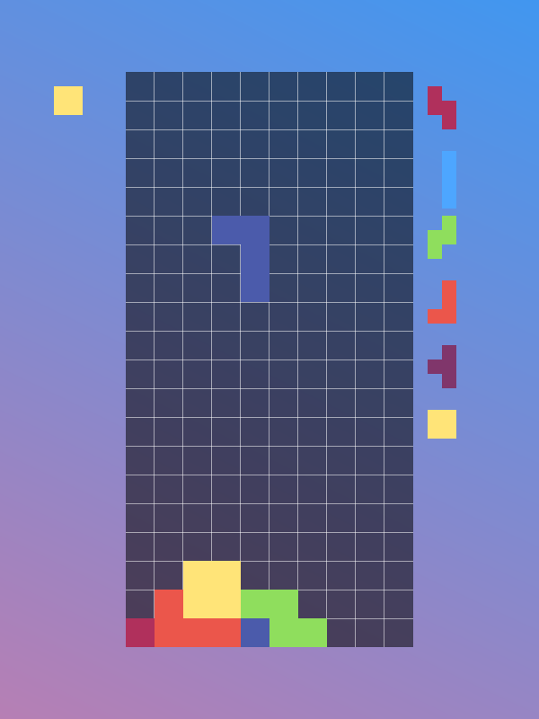

# raytris



That one copyrighted falling block game.

## Controls
- **Arrow keys**: Move
- **Z, X**: Rotate
- **C**: Hold
- **Space**: Hard drop

## Features

### Implemented
- Base game
- Color and background configuration
- Custom background shaders

### TODO (non-exhaustive)
- Animations
- Scoring
- Difficulty
- Menus
- Control configuration
- More background shader uniforms
- Post-processing shaders

## Build

The repository should contain everything you need to build (make sure to clone recursively):

```
mkdir build && cd build 
cmake ..
make
```

On Windows, the Ninja generator seems to put up the least fight:

```
mkdir build && cd build
cmake -G Ninja ..
ninja
```

The output binary is `raytris.exe`. If you move it, copy the `resources` directory along with it.
